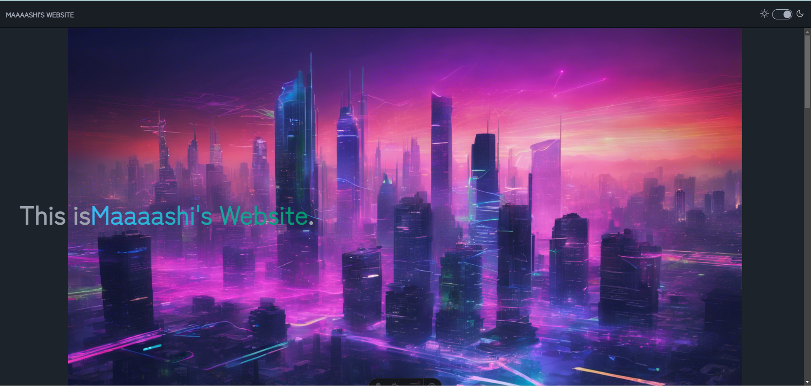

# Maaaashi's Website



<div align="center">Github repository containing the source code for Maaaashi's Website.</div>

<p align="center">
<a href="https://twitter.com/pg_maaaashi" rel="nofollow">
  
</a>

## Table of Contents

- [Maaaashi's Website](#maaaashis-website)
  - [Table of Contents](#table-of-contents)
- [Development](#development)
- [Start Server](#start-server)
- [E2E](#e2e)

# Development

```bash
$ git clone https://github.com/maaaashi/maaaashi-website2.git
$ cd maaaashi-website2
$ npm install
```

# Start Server

```bash
$ make dev
```

Access to http://localhost:4321

# E2E

```bash
$ cd e2e/
$ gauge run specs
```
